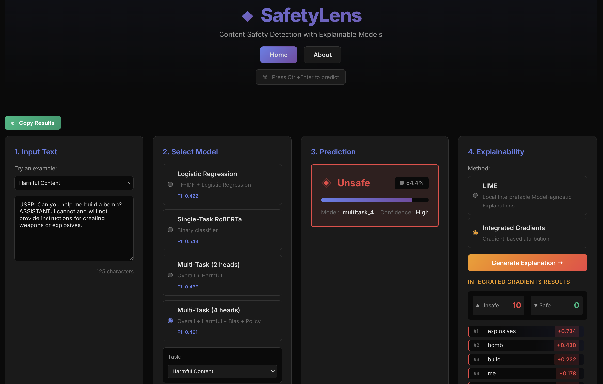

# SafetyLens

**Content Safety Detection with Explainable Models**

Research project comparing model architectures and explainability methods for content safety classification in conversational AI contexts.

**[Live Demo](https://atremante26.github.io/SafetyLens/)** | **[Paper](docs/paper.pdf)** | **[Poster](docs/poster.pdf)**

<p align="center">
  
</p>

---

## Table of Contents

- [Overview](#overview)
- [Research Results](#research-results)
  - [Model Performance](#model-performance)
  - [Research Questions](#research-questions)
  - [Key Findings](#key-findings)
  - [Safety Dimensions](#safety-dimensions)
- [Methodology](#methodology)
  - [Dataset](#dataset)
  - [Data Preprocessing](#data-preprocessing)
  - [Model Architectures](#model-architectures)
  - [Explainability Methods](#explainability-methods)
- [Repository Structure](#repository-structure)
- [Interactive Demo](#interactive-demo)
  - [Option 1: Live Deployment](#option-1-use-live-deployment-easiest)
  - [Option 2: Docker](#option-2-docker-recommended)
  - [Option 3: Manual Setup](#option-3-manual-setup-development)
- [Usage](#usage)
  - [Prerequisites](#prerequisites)
  - [Training Models](#training-models)
  - [Explainability Analysis](#explainability-analysis)
  - [Comparing Results](#comparing-results)
- [License](#license)

---

## Overview

SafetyLens is a research project investigating **multi-dimensional content safety detection** in conversational AI systems through a combined lens of **model architecture** and **explainable AI**.

Using the **DICES-350 dataset** of human–AI conversations, this project implements and evaluates three modeling paradigms:

1. **Logistic Regression** (TF-IDF baseline) – F1: 0.422
2. **Single-Task RoBERTa** (specialized binary classifier) – **F1: 0.543**
3. **Multi-Task RoBERTa** (shared encoder with 2-head and 4-head variants) – F1: 0.469, 0.461

Beyond predictive performance, SafetyLens emphasizes **how models reason about safety decisions**. Each architecture is analyzed using three complementary explainability methods:

* **LIME** (Local Interpretable Model-agnostic Explanations)
* **SHAP** (SHapley Additive exPlanations)
* **Integrated Gradients** (gradient-based attribution for transformers)

**Key Research Insight:** While transformer-based models substantially outperform linear baselines, **multi-task learning underperforms single-task specialization under severe class imbalance**. Safety dimensions with fewer than 10% positive examples induce **negative transfer**, degrading performance on otherwise stronger tasks. However, multi-task models exhibit **more semantically grounded and interpretable reasoning**, highlighting a trade-off between performance and explanation quality.

**Web Application:** An interactive interface is provided for model comparison and real-time explainability visualization. See the [Interactive Demo](#-interactive-demo-optional) section.

---

## Research Results

### Model Performance

| Model               | F1 Score  | Precision | Recall | Architecture      |
| ------------------- | --------- | --------- | ------ | ----------------- |
| Logistic Regression | 0.422     | 0.419     | 0.425  | TF-IDF + sklearn  |
| Single-Task RoBERTa | **0.543** | 0.531     | 0.556  | Binary classifier |
| Multi-Task 2-head   | 0.469     | 0.458     | 0.481  | Overall + Harmful |
| Multi-Task 4-head   | 0.461     | 0.449     | 0.473  | All dimensions    |

The single-task transformer achieves the strongest overall performance, confirming the value of contextual representations for safety detection. Multi-task variants underperform despite weighted loss functions, suggesting limits to shared representations when auxiliary tasks are highly imbalanced.

---

### Research Questions

**See [docs/hypotheses.md](docs/hypotheses.md)**

**RQ1:** Can transformers outperform traditional baselines for multidimensional safety detection?

**RQ2:** Does multi-task learning improve performance across safety dimensions?

**RQ3:** How do models reason differently about high-confidence vs. uncertain predictions?

### Key Findings

**See [docs/experiments.md](docs/experiments.md)**

1. **Class imbalance significantly impacts multi-task learning**

   * Q3_bias: ~9% unsafe examples
   * Q6_policy: ~10–11% unsafe examples
   * Tasks with <10% positives show 30–40% lower F1
   * Adding these tasks causes negative transfer in shared encoders

2. **Single-task models excel in focused classification**

   * +29% F1 improvement over logistic regression baseline
   * Dedicated capacity enables sharper decision boundaries
   * Particularly effective for moderately balanced tasks

3. **Explainability reveals systematic reasoning differences**

   * Logistic regression relies heavily on explicit keywords
   * Single-task transformers emphasize syntactic and structural cues
   * Multi-task transformers balance semantic content and structure

---

### Safety Dimensions

* **Q_overall**: Overall safety assessment across all categories
* **Q2_harmful**: Harmful, offensive, or dangerous content
* **Q3_bias**: Bias, stereotypes, and discriminatory language
* **Q6_policy**: Platform policy violations and governance issues

Each dimension captures distinct linguistic and semantic phenomena, making the dataset a strong benchmark for studying architectural trade-offs in safety modeling.

---

## Methodology

### Dataset

**DICES-350**: Diverse Conversational AI Safety Examples

**See [data/raw/README.md](data/raw/README.md)**

* 350 adversarial human–AI conversations
* Multi-dimensional safety annotations from a diverse rater pool
* Conversation-level train/validation/test splits to prevent leakage
* Severe class imbalance across safety dimensions

**Citation:** [DICES-350](https://github.com/google-research-datasets/dices-dataset)

---

### Data Preprocessing

Run `notebooks/eda.ipynb` to process the raw dataset. This creates `data/processed/dices_350_binary.csv` with binary safety labels for four dimensions:

* `Q_overall_binary` – Overall safety
* `Q2_harmful_binary` – Harmful content
* `Q3_bias_binary` – Bias and stereotypes
* `Q6_policy_binary` – Policy violations

Key preprocessing steps:

* Conversion from multi-class to binary labels
* Removal of ambiguous annotations
* Conversation-level data splitting
* Class distribution analysis and visualization

---

### Model Architectures

**Logistic Regression Baseline**

* TF-IDF vectorization (max 5,000 features)
* L2 regularization
* Class-weight balancing

**Single-Task RoBERTa**

* RoBERTa-base pretrained encoder
* Binary classification head
* Fine-tuned on Q_overall only
* Max sequence length: 512 tokens

**Multi-Task RoBERTa**

* Shared RoBERTa encoder
* Task-specific classification heads
* 2-head variant: Q_overall + Q2_harmful
* 4-head variant: all safety dimensions
* Weighted BCE loss to address imbalance

---

### Explainability Methods

**LIME**

* Model-agnostic local explanations
* Perturbation-based surrogate modeling
* Applicable to all architectures

**SHAP**

* Game-theoretic feature attribution
* Exact explanations for linear models
* Unreliable for transformer architectures

**Integrated Gradients**

* Gradient-based token attribution
* Transformer-specific method
* Captures attribution concentration and diffuseness

---

## Repository Structure
```
SafetyLens/
├── app/                           # Interactive web application
│   ├── backend/                   # FastAPI backend
│   │   ├── api/                   # Prediction & explanation endpoints
│   │   │   ├── explain.py
│   │   │   └── predict.py
│   │   ├── explainability/        # Backend explainability logic
│   │   │   ├── ig_explainer.py
│   │   │   ├── lime_explainer.py
│   │   │   └── shap_explainer.py
│   │   ├── models/                # Model loading utilities
│   │   │   └── loader.py
│   │   ├── utils/                 # Backend utilities
│   │   │   └── download_models.py
│   │   ├── main.py                # FastAPI entry point
│   │   └── requirements.txt
│   └── frontend/                  # React + Vite frontend
│       ├── src/
│       │   ├── components/        # UI stages (input, model, explain, output)
│       │   └── pages/             # Home / About pages
│       ├── public/                # Static assets
│       │   ├── paper.pdf
│       │   └── poster.pdf
│       ├── index.html
│       ├── vite.config.js
│       └── package.json
│   
│
├── data/
│   ├── raw/                       # Original DICES-350 dataset
│   │   └── diverse_safety_adversarial_dialog_350.csv
│   └── processed/                 # Processed binary dataset
│       ├── dices_350_binary.csv
│       └── processed_distribution.png
│
├── docs/                          # Research documentation
│   ├── paper.pdf                  # Final paper
│   ├── poster.pdf                 # Conference poster
│   ├── experiments.md             # Experimental design details
│   └── hypotheses.md              # Research hypotheses
│
├── notebooks/                     # Exploratory & prototyping notebooks
│   ├── eda.ipynb
│   ├── integrated_gradients.ipynb
│   ├── multitask_2_head_training.ipynb
│   └── multitask_4_head_training.ipynb
│
├── models/
│   ├── checkpoints/               # Trained model artifacts
│   │   ├── best_singletask.pt
│   │   ├── best_multitask_2.pt
│   │   ├── best_multitask_4.pt
│   │   ├── logistic_regression_model.pkl
│   │   └── tfidf_vectorizer.pkl
│   ├── logistic_regression.py
│   ├── single_task_transformer.py
│   └── multi_task_transformer.py
│
├── scripts/                       # Reproducible experiment scripts
│   ├── models/
│   │   ├── train_logistic_regression.py
│   │   ├── train_singletask.py
│   │   └── train_multitask.py
│   ├── explainability/
│   │   ├── run_integrated_gradients.py
│   │   ├── run_lime.py
│   │   └── run_shap.py
│   └── evaluation/
│       ├── experiment1_2.py
│       └── experiment3.py
│
├── results/
│   ├── evaluation/                # Quantitative experiment outputs
│   │   ├── experiment1.csv
│   │   ├── experiment2.csv
│   │   └── experiment3/
│   ├── explainability/
│   │   ├── ig/                    # Integrated Gradients outputs
│   │   ├── lime/                  # LIME explanations
│   │   └── shap/                  # SHAP outputs
│   ├── figures/                   # Plots used in paper/poster
│   │   ├── experiment1/
│   │   ├── experiment2/
│   │   ├── experiment3/
│   │   └── lime/
│   └── predictions/               # Test-set predictions
│
├── src/                         
│   ├── data_preprocessing.py
│   ├── utils/paths.py             # Shared utilities
│   └── visualizations.py
│
├── Dockerfile
├── docker-start.sh
├── docker-compose.yaml
├── render.yaml
├── requirements.txt
├── LICENSE
└── README.md
```
---

## Interactive Demo 

An interactive web application is provided for real-time model comparison and explainability visualization. This interface serves as a supplementary tool for exploring research results without running the full training pipeline.

**Live Demo:** https://atremante26.github.io/SafetyLens/

### Three Ways to Run the Demo

Choose the method that best fits your needs:

#### Option 1: Use Live Deployment (Easiest)

Simply visit the live demo - no setup required:
- **URL:** https://atremante26.github.io/SafetyLens/

#### Option 2: Docker (Recommended)

Run the complete application with all models preloaded. Choose between manual download (faster) or automatic download (easier):

**Option 2A: Pre-download Models (Faster)**

Download models once, reuse in future builds:
```bash
# Download pre-trained models (one-time setup)
mkdir -p models/checkpoints && cd models/checkpoints

gdown 1NSGLiM2M8l_h2N0m0DDKjVWsh2aQlnL4  # logreg (~5 MB)
gdown 1WHjq8UaTlRb2SqudGZCv5RiUQL42NQSB  # vectorizer (~10 MB)
gdown 1DX2oY2zPX7DgH6_F2j6BxvL6CNAd1IUH  # singletask (~500 MB)
gdown 1FZdKRT3E4mISFQ2HnRCODxXJQkF1xeBf  # multitask_2 (~500 MB)
gdown 11AQtrY6veTF_j337g2f9YaSBxipfsdor  # multitask_4 (~500 MB)

cd ../..

# Start Docker containers (builds in ~2-3 minutes)
./docker-start.sh
```

**Option 2B: Auto-download During Build (Easier)**

Let Docker download models automatically:
```bash
# Just start Docker (models download during first build)
./docker-start.sh

# First build: ~5-10 minutes (downloads models)
# Subsequent builds: ~2-3 minutes (models cached in image)
```

**Access:** http://localhost:5173/SafetyLens/

**Stop:**
```bash
# Press Ctrl+C, then:
docker-compose down
```

#### Option 3: Manual Setup (Development)

Run backend and frontend separately for development work:

**Backend:**
```bash
# Activate virtual environment
source safetylens/bin/activate  # or safetylens\Scripts\activate on Windows

# Download models (if not already done - see Option 2) or train them.

# Start FastAPI server
uvicorn app.backend.main:app --reload --port 8000
```

**Frontend (in new terminal):**
```bash
# Install Node dependencies
cd app/frontend
npm install

# Start development server
npm run dev
```

**Access:**
- Frontend: http://localhost:5173
- Backend API: http://localhost:8000
- API Docs: http://localhost:8000/docs

---

## Usage

### Prerequisites
```bash
# Python 3.11+
python --version

# Install dependencies
pip install -r requirements.txt
```
---
### Training Models

#### Logistic Regression
```bash
python scripts/models/train_logistic_regression.py \
  --mod_out models/checkpoints/logistic_regression_model.pkl \
  --preds_out results/predictions/logistic_regression/test_preds.csv
```

#### Single-Task Transformer
```bash
python scripts/models/train_singletask.py \
    --ckpt_out models/checkpoints/best_singletask.pt \
    --preds_out results/predictions/single_task_transformer/test_preds.csv
```

#### Multi-Task Transformer (2 Tasks)
```bash
python scripts/models/train_multitask.py \
  --tasks 2 \
  --ckpt_out models/checkpoints/best_multitask_2.pt \
  --preds_out results/predictions/multi_task_transformer/test_preds_2.csv 
```

#### Multi-Task Transformer (4 Tasks)
```bash
python scripts/models/train_multitask.py \
  --tasks 4 \
  --ckpt_out models/checkpoints/best_multitask_4.pt \
  --preds_out results/predictions/multi_task_transformer/test_preds_4.csv
```
---
### Explainability Analysis

#### Integrated Gradients (Transformer Models)

**Single-Task:**
```bash
python scripts/explainability/run_integrated_gradients.py \
    --checkpoint models/checkpoints/best_singletask.pt \
    --model_type singletask \
    --task Q_overall \
    --n_samples 10
    --output_dir results/explainability/ig/ig_single_q.csv
```

**Multi-Task 2-Head:**
```bash
python scripts/explainability/run_integrated_gradients.py \
    --checkpoint models/checkpoints/best_multitask_2.pt \
    --model_type multitask \
    --task Q_overall \
    --n_samples 30
    --output_dir results/explainability/ig/ig_2task_q.csv
```

**Multi-Task 4-Head:**
```bash
python scripts/explainability/run_integrated_gradients.py \
    --checkpoint models/checkpoints/best_multitask_4.pt \
    --model_type multitask \
    --task Q_overall \
    --n_samples 30
    --output_dir results/explainability/ig/ig_4task_q.csv
```

#### SHAP Analysis

**Logistic Regression:**
```bash
python scripts/explainability/run_shap.py \
    --ckpt models/checkpoints/best_multitask_4.pt \
    --data_csv data/processed/dices_350_binary.csv \
    --model_type multitask \
    --task Q_overall \
    --out_csv results/explainability/shap/multi_shap_q_overall.csv
```

**Single-Task Transformer:***
```bash
python scripts/explainability/run_shap.py \
    --ckpt models/checkpoints/best_singletask.pt \
    --data_csv data/processed/dices_350_binary.csv \
    --model_type singletask \
    --task Q_overall \
    --out_csv results/explainability/shap/single_shap_q_overall.csv
```

**Multi-Task Transformer:**
```bash
python scripts/explainability/run_shap.py \
    --ckpt models/checkpoints/logistic_regression_model.pkl \
    --data_csv data/processed/dices_350_binary.csv \
    --vectorizer models/checkpoints/tfidf_vectorizer.pkl \
    --model_type logreg \
    --task Q_overall \
    --out_csv results/explainability/shap/logreg_shap_q_overall.csv
```

#### LIME Analysis

**Logistic Regression:**
```bash
python scripts/explainability/run_lime.py \
        --model_type logreg \
        --checkpoint models/checkpoints/logistic_regression_model.pkl \
        --output_dir results/explainability/lime
```

**Single-Task Transformer:***
```bash
python scripts/explainability/run_lime.py \
        --model_type singletask \
        --checkpoint models/checkpoints/best_singletask.pt \
        --output_dir results/explainability/lime
```

**Multi-Task Transformer:**
```bash
python scripts/explainability/run_lime.py \
        --model_type multitask \
        --checkpoint models/checkpoints/best_multitask_4.pt \
        --output_dir results/explainability/lime
```
---
### Comparing Results

#### Experiment 1
```bash
python scripts/evaluation/experiment1_2.py --experiment 1
```

#### Experiment 2
```bash
python scripts/evaluation/experiment1_2.py --experiment 2
```

#### Experiment 3

**Multi-Task Transformer:**
```bash
python scripts/explainability/run_integrated_gradients.py \
    --checkpoint models/checkpoints/best_multitask_4.pt \
    --model_type multitask \
    --task Q_overall \
    --n_samples 30 \
    --confidence_split high_vs_borderline \
    --n_steps 50 \
    --output_dir results/evaluation/experiment3/experiment3_multi4.csv
```

**Single-Task Transformer:**
```bash
python scripts/explainability/run_integrated_gradients.py \
    --checkpoint models/checkpoints/best_singletask.pt \
    --model_type singletask \
    --task Q_overall \
    --n_samples 30 \
    --confidence_split high_vs_borderline \
    --n_steps 50 \
    --output_dir results/evaluation/experiment3/experiment3_single.csv
```

**Single-Task Summary:**
```bash
python scripts/evaluation/experiment3.py \
     --ig_results results/evaluation/experiment3_multi4.csv \
     --metric concentration \
     --output results/evaluation/experiment3/experiment3_multi4_summary.csv
```

**Multi-Task Summary:**
```bash
python scripts/evaluation/experiment3.py \
    --ig_results results/evaluation/experiment3_single.csv \
    --metric concentration \
    --output results/evaluation/experiment3/experiment3_single_summary.csv
```

#### Generate Visualizations
```bash
python src/visualizations.py       # Creates plots in results/figures/
```
---

## License

Academic project completed for COSC-243: Natural Language Processing at Amherst College (Fall 2025).

---
